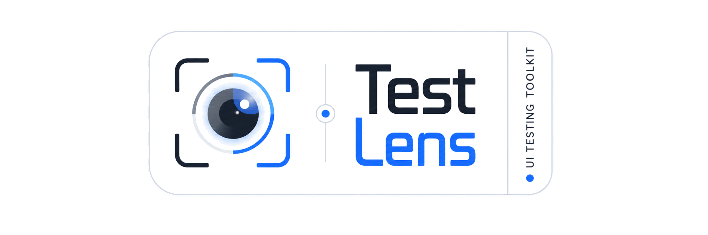

<p align="center">
  
</p>

# Selenium Test Lens

Selenium Test Lens adds observable, retryable interactions, an in-browser diagnostic HUD, trace reports, and evidence capture to the Selenium `WebDriver` your test framework already owns.

Successful operations that required a recovery retry are exposed as a per-session `RetrySummary`. The default `REPORT_ONLY` policy preserves existing outcomes; `WARN`, `FAIL_AFTER_N`, and `FAIL_ON_ANY_RETRY` can make flaky candidates visible or reject an otherwise passed test after reports are written.

- [Documentation](https://test-lens.github.io/selenium-test-lens/)
- [Maven Central](https://central.sonatype.com/artifact/io.github.test-lens/selenium-test-lens/0.1.0)
- [Javadoc](https://javadoc.io/doc/io.github.test-lens/selenium-test-lens/0.1.0/)
- [Changelog](CHANGELOG.md)
- [Issues](https://github.com/Test-Lens/selenium-test-lens/issues)

## Requirements

- Java 17 or newer
- Maven 3.x
- A Selenium `WebDriver` created and managed by the consuming test project

## Install

The latest Maven Central release is `0.1.0`. The repository itself is on the
unreleased `0.2.0-SNAPSHOT` development line; snapshot coordinates shown for
the runner adapters require a local source build or a configured snapshot
repository.

```xml
<dependency>
    <groupId>io.github.test-lens</groupId>
    <artifactId>selenium-test-lens</artifactId>
    <version>0.1.0</version>
</dependency>
```

Selenium is consumer-owned and must be declared separately at the version managed by your project:

```xml
<dependency>
    <groupId>org.seleniumhq.selenium</groupId>
    <artifactId>selenium-java</artifactId>
    <version>${selenium.version}</version>
</dependency>
```

When building the current source tree, JUnit 5 users can add the lifecycle extension instead of writing per-test setup and teardown:

```xml
<dependency>
    <groupId>io.github.test-lens</groupId>
    <artifactId>selenium-test-lens-junit5</artifactId>
    <version>0.2.0-SNAPSHOT</version>
    <scope>test</scope>
</dependency>
```

```java
@RegisterExtension
final TestLensExtension testLens =
        TestLensExtension.builder(ChromeDriver::new).build();

@Test
void savesOrder(WebDriver driver, TestLens lens) {
    driver.get(applicationUrl);
    lens.getByTestId("save").click();
}
```

The extension owns one driver per JUnit invocation, maps passed, failed, and aborted outcomes to Lens, writes reports, and then calls `quit()`. Do not also quit that driver in `@AfterEach`. See the [JUnit 5 integration guide](docs/integrations/junit5.md).

When building the current source tree, TestNG users can use the listener adapter:

```xml
<dependency>
    <groupId>io.github.test-lens</groupId>
    <artifactId>selenium-test-lens-testng</artifactId>
    <version>0.2.0-SNAPSHOT</version>
    <scope>test</scope>
</dependency>
```

```java
@Listeners(TestLensTestNgListener.class)
@TestLensTestNg(factory = ChromeFactory.class)
class LoginTest {
    @Test
    void login() {
        TestLensTestNgContext.current().lens().getByTestId("login").click();
    }
}
```

The listener owns a fresh driver for every physical invocation, including DataProvider and retry attempts, finalizes Lens, and then calls `quit()`. Both annotations are required. See the [TestNG integration guide](docs/integrations/testng.md).

```java
TestLensOptions options = TestLensOptions.builder()
        .retryOutcomePolicy(RetryOutcomePolicy.FAIL_AFTER_N)
        .allowedRetries(1)
        .build();
```

`allowedRetries` is the permitted number of recovery retries; `FAIL_AFTER_N` fails only when the session total is greater than that limit. See [Flakiness and retry outcomes](docs/observability/flakiness.md).

## First session

```java
import io.github.testlens.TestLens;
import org.openqa.selenium.By;
import org.openqa.selenium.WebDriver;

WebDriver driver = createExistingFrameworkDriver();
TestLens lens = TestLens.attach(driver);
try {
    lens.startSession("login");
    driver.get("https://example.test/login");

    lens.locator(By.id("username"), "Username").fill("john");
    lens.locator(By.id("login"), "Login").click();
    lens.locator(By.id("welcome"), "Welcome").expect().toBeVisible();
    lens.finishPassed();
} catch (RuntimeException | Error failure) {
    lens.finishFailed(failure);
    throw failure;
} finally {
    driver.quit();
}
```

The main Test Lens facade does not own browser lifecycle or displace JUnit, TestNG, Allure, or another reporter. The optional JUnit 5 and TestNG adapters deliberately own drivers created by their factories. Existing raw Selenium remains valid for operations the Lens facade does not wrap. React-specific support is available as a separate, optional module.

Every final `FAILED` session receives a best-effort [failure bundle](docs/observability/failure-bundles.md): diagnostic and clean screenshots, context, trace-derived diagnostics, runtime/configuration allowlists, current network summary, manifest, final reports, and ZIP. Raw page source and browser console are disabled by default because they can contain secrets; enable them explicitly with `FailureBundleOptions.complete()`.

Passive network capture is available through Selenium 4.39 WebDriver BiDi. Create Chrome or Firefox options with `enableBiDi()`, then start `lens.network()` in `BIDI` or `AUTO`; neither mode falls back when BiDi is unavailable. `MANUAL` remains the default and performance logs remain unsupported. See [Network diagnostics](docs/advanced/network.md).

Finalize every session with its real runner outcome: `finishPassed()`, `finishFailed(Throwable)`, or `finishSkipped(String)`. Skipped finalization records the reason and writes reports without taking a failure screenshot or closing the driver.

See the [getting-started guide](https://test-lens.github.io/selenium-test-lens/getting-started/) and [framework integration guide](https://test-lens.github.io/selenium-test-lens/framework-integration/) for lifecycle patterns and the full usage documentation.

## Build

```powershell
mvn clean verify
```

The default build runs the fast unit suite. Real-browser integration tests are isolated in an unpublished consumer module and enabled explicitly:

```powershell
mvn -Pbrowser-it -Dbrowser=chrome -Dheaded=false verify
mvn -Pbrowser-it -Dbrowser=firefox -Dheaded=false verify
```

Use `-Dheaded=true` for local visual debugging. The current CI browser gate covers local Chrome and Firefox drivers; Edge and `RemoteWebDriver` grids are not part of this matrix.

See [Real-browser integration tests](docs/browser-integration-tests.md) for prerequisites, scenarios, and CI behavior.

## License

Licensed under the [Apache License 2.0](LICENSE).
