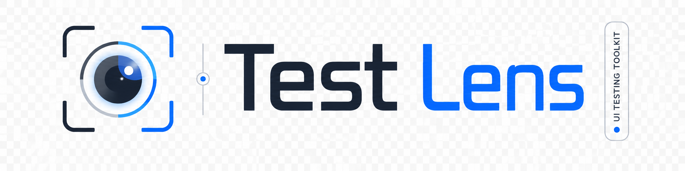

<p align="center">
  
</p>

# Selenium Test Lens

Selenium Test Lens is an observability, diagnostics, and reporting toolkit for Selenium/WebDriver UI tests. It adds resilient WebDriver actions, retryable assertions, visual debugging, evidence capture, auth/session state helpers, network diagnostics, offline HTML reports, machine-readable JSON reports, and portable report ZIP bundles.

The project is currently `0.1.0-SNAPSHOT` and pre-1.0. Public APIs are usable, but may still be polished before a first release.

Repository: https://github.com/test-lens/selenium-test-lens

Maven coordinates use `io.github.testlens`, module artifactIds use the `selenium-test-lens-*` naming scheme, and public Java packages live under `io.github.testlens`. Default report and evidence output paths still use `target/ui-test-lens...` for compatibility with existing local and CI artifacts.

## Requirements

- Java 17
- Maven 3.x
- Selenium supplied by the consuming test project

Maven Central publishing is not configured yet. For local use, build and install from this repository.

## Quick Start

All-in-one dependency:

```xml
<dependency>
    <groupId>io.github.testlens</groupId>
    <artifactId>selenium-test-lens</artifactId>
    <version>0.1.0-SNAPSHOT</version>
</dependency>
```

Selenium-only layer:

```xml
<dependency>
    <groupId>io.github.testlens</groupId>
    <artifactId>selenium-test-lens-selenium</artifactId>
    <version>0.1.0-SNAPSHOT</version>
</dependency>
```

Minimal usage:

```java
import io.github.testlens.JsOverlayDebug;
import io.github.testlens.OverlayConfig;
import io.github.testlens.hud.HudPosition;
import io.github.testlens.hud.HudTheme;
import io.github.testlens.hud.HudThemePreset;
import org.openqa.selenium.WebDriver;

WebDriver driver = createDriver();

OverlayConfig config = OverlayConfig.builder()
        .hudPosition(HudPosition.TOP_RIGHT)
        .hudTheme(HudThemePreset.GLASS)
        .build();

HudTheme cappedHud = HudTheme.builder()
        .maxHeightPx(420)
        .build();

JsOverlayDebug overlay = new JsOverlayDebug(driver, config);

overlay.setStep("Save order");
overlay.hudLog("info", "Clicking save", "local");

overlay.getByTestId("save-order").click();

overlay.expect(overlay.getByTestId("toast"))
        .toContainText("Saved");
```

## Build

Recommended checks:

```powershell
mvn -q test
mvn -q -DskipTests compile
```

Module checks:

```powershell
mvn -q -pl selenium-test-lens-core test
mvn -q -pl selenium-test-lens-overlay -am test
mvn -q -pl selenium-test-lens-selenium -am test
mvn -q -pl selenium-test-lens-react -am test
mvn -q -pl selenium-test-lens-examples -am test
mvn -q -pl selenium-test-lens -am test
```

Consumer demo command:

```powershell
mvn test "-Dheaded=true" "-Dlens.theme=GLASS" "-Dlens.report.theme=LIGHT"
```

## Reports

<p align="center">
  
</p>

HTML is the human-readable report. JSON is the machine-readable integration format. ZIP bundles package the static HTML, JSON, manifest, and copied artifacts for CI artifacts or API uploads.

Default output paths:

```text
target/ui-test-lens-report/index.html
target/ui-test-lens-report/report.json
target/ui-test-lens-report/ui-test-lens-report.zip
```

```java
UiTestLensSession checkout = overlay.startSession("Checkout flow");
checkout.exportHtml(Path.of("target/ui-test-lens-report/checkout-flow.html"));
checkout.exportJsonReport();

new TraceHtmlExporter().exportSuiteToDefault(List.of(checkout),
        TraceHtmlExportOptions.builder()
                .theme(HtmlReportTheme.AUTO)
                .build());

new TraceJsonExporter().exportSuiteToDefault(List.of(checkout));
new TraceReportBundleExporter().exportSuiteToDefault(List.of(checkout));
```

Report themes are independent from HUD themes: `HtmlReportTheme.LIGHT`, `DARK`, and `AUTO`.

The JSON schema uses `schemaVersion` `1.0`. ZIP bundles never store absolute artifact paths or `..` entries; missing artifact files are listed in `manifest.json` warnings instead of failing export.

Example upload command:

```powershell
curl -F "report=@target/ui-test-lens-report/ui-test-lens-report.zip" https://example.com/api/reports
```

## Modules

| Module | Responsibility |
|---|---|
| `selenium-test-lens-core` | Internal logging, trace/evidence model, JSON/HTML/ZIP report exporters. No Selenium dependency. |
| `selenium-test-lens-overlay` | Runtime JavaScript overlay resources, HUD configuration, visual debugging assets. No Selenium dependency. |
| `selenium-test-lens-selenium` | Selenium facade, locators, assertions, actionability, evidence, auth/session state, network diagnostics. |
| `selenium-test-lens-react` | React-specific support layered on top of Selenium integration. |
| `selenium-test-lens` | All-in-one POM dependency bundle. |
| `selenium-test-lens-examples` | Documentation and compile-check examples. Not intended as a runtime dependency. |

## Documentation

- [Getting started](docs/getting-started.md)
- [Configuration](docs/configuration.md)
- [Visual overlay and HUD](docs/visual-overlay-hud.md)
- [API reference](docs/api-reference.md)
- [Examples](docs/examples.md)
- [Architecture](docs/architecture.md)
- [Migration](docs/migration.md)
- [Release verification](docs/release.md)
- [Roadmap](docs/roadmap.md)

## License

Selenium Test Lens is licensed under the [Apache License 2.0](LICENSE).

## Current Scope

Selenium Test Lens runs on top of Selenium/WebDriver and adds diagnostic APIs:

- visual HUD and element debugging
- configurable blocking overlay policy
- actionability checks
- ergonomic `UiLocator` helpers
- retryable web assertions
- business assertions and named steps
- trace/evidence session model, polished HTML reports, JSON reports, and portable ZIP bundles
- screenshot capture and video attachments
- auth/session state capture and restore
- passive network diagnostics and wait-for-response assertions

Current limitations:

- `getByRole` does not implement the full ARIA accessible-name algorithm.
- network diagnostics are passive; browser capture providers and interception/mocking are not implemented.
- video support is attachment/reference based; Selenium Test Lens does not record video.
- HUD themes focus on the HUD panel; Wait HUD and assertion badges are not fully covered by the common theme system.

