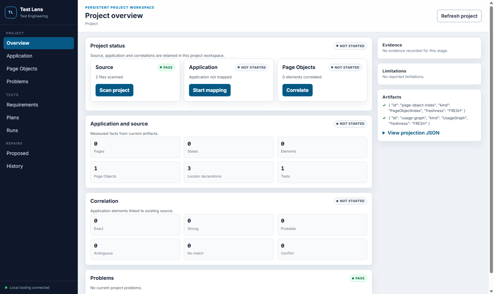
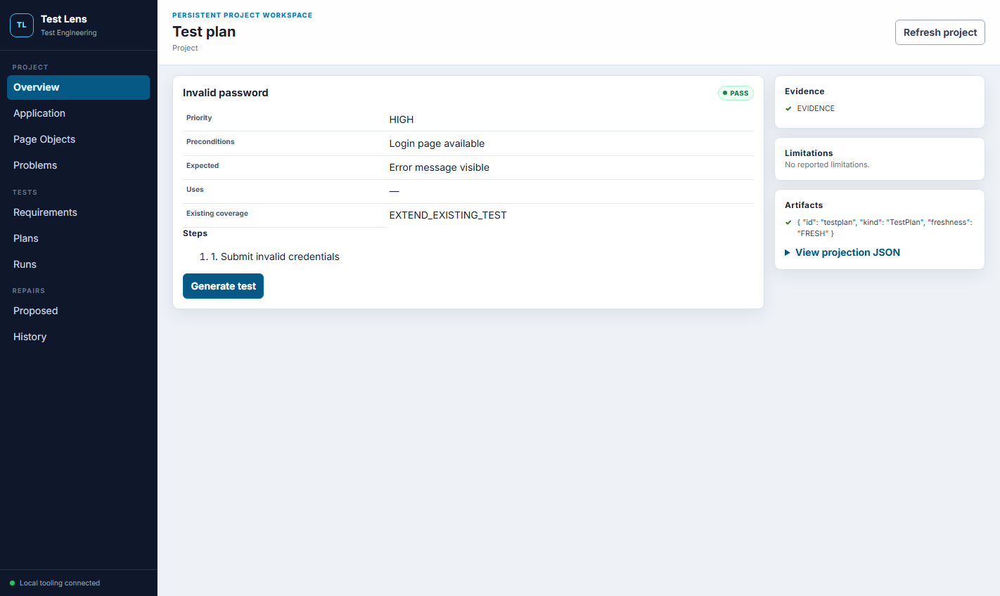
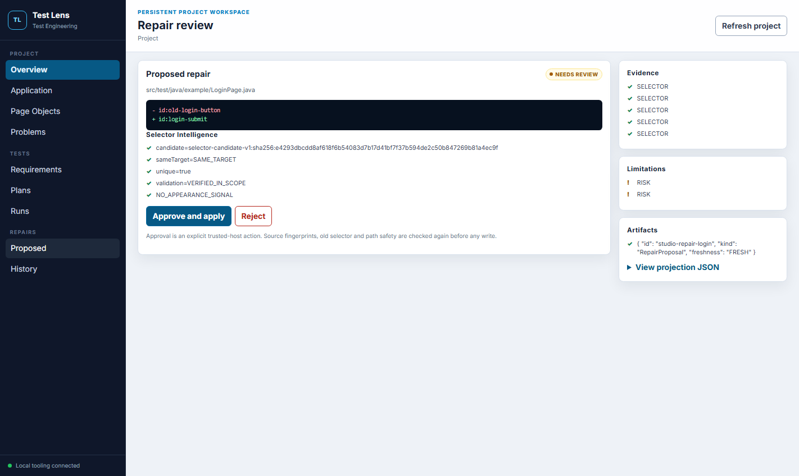

# Test Engineering Studio

!!! warning "Development tooling"
    Test Engineering Studio is source-only work for the next Test Lens release. It is not included in Maven 0.4.0 and is not a remotely hosted service.

Test Engineering Studio is a local, persistent interface over the deterministic Application Mapper, existing-Page-Object index, `ContextSlicer`, S12 agent workflow, targeted compiler and trusted repair boundary. It is separate from the runtime HUD.



## Project setup

Open one explicit project root, then use the setup actions in order:

1. **Scan project** indexes Page Objects, components, tests, locator declarations and bounded usage edges.
2. **Map application** observes the caller-owned browser. `CURRENT_PAGE` performs one observation; repeated `GUIDED` observations retain the mapper session and aggregate visited pages and states.
3. **Correlate Page Objects** relates application elements to existing source declarations using S11 evidence. Studio displays `EXACT`, `STRONG`, `PROBABLE`, `AMBIGUOUS`, `NO_MATCH` and `CONFLICT`; it does not recalculate those decisions.
4. **Problems** centralizes selector review, ambiguous or missing correlation, source-index limitations and partial mapping.

Counts are measured facts, not a fabricated coverage percentage. A partial mapper result remains `PARTIAL`, with limitations visible in the evidence panel.

## Create and review a test

Enter a short observable requirement. Studio builds a redacted, bounded `AgentContextPack` from the current `ApplicationModel`, `PageObjectIndex`, correlation and usage graph. It records included and excluded scope rather than sending the whole repository.



The reviewable workflow deliberately separates three actions:

- **Generate plan** calls the Architect and stores a structured `TestPlan`.
- **Generate test** calls the Implementer and shows the exact `TestImplementationProposal` plus deterministic policy results.
- **Run** replays those reviewed artifacts into the existing S12 coordinator, then performs policy validation, compilation, targeted execution and review.

Viewing a plan or proposed patch never compiles or starts a browser test. Page-Objects-only policy still rejects raw `By`, direct `findElement`, sleeps and JavaScript workarounds before execution.

## Run and diagnose

The run view presents compilation and execution status, bounded diagnostics, Test Lens trace references, duration and workflow attempts. Raw diagnostics remain behind progressive disclosure. Agent failures retain their structured code, including `AGENT_TIMEOUT`, `AGENT_OUTPUT_INVALID` and `AGENT_CONTEXT_REJECTED`.

When execution fails, the diagnosis projection shows the existing `FailureClassification`, evidence, counter-evidence and affected source scope. Studio does not reinterpret a product defect as a selector problem.

## Review a repair



Repairs preserve the trusted-host boundary:

```text
failure evidence
-> FailureClassification
-> Selector Intelligence
-> RepairProposal (PROPOSE_ONLY)
-> human Approve or Reject
-> TrustedRepairApplier
-> verification run
```

Opening or rejecting a proposal never changes source. **Approve and apply** sends only the proposal identifier. The local host resolves the stored proposal and rechecks the allowed source root, path and symlink safety, project and declaration fingerprints, and old selector. A stale proposal returns `SOURCE_PRECONDITION_FAILED`; there is no force-apply endpoint.

## Workspace and artifacts

Bounded projections are written below the selected project root:

```text
.test-lens/
  project/
    project-status.json
    application-model.json
    page-object-index.json
    usage-graph.json
    correlations.json
    problems.json
  ai/
    workflow-history.json
  repairs/
    history.json
```

The UI reads projections instead of transferring full models or source trees on every request. Correlations and problems are paged with bounded offsets and limits. Refreshing the browser performs read-only `GET` requests; it does not rerun agents, tests, mapping or repair application.

## Local transport security

The tooling host binds an ephemeral port on `127.0.0.1` only. It uses a random 256-bit session token, exact Host and same-origin checks, bounded JSON bodies, CSP, an action allowlist and one in-process operation lock. It exposes no arbitrary file-write or command endpoint. Backend strings and source diffs are rendered as text, not HTML.

Requirements and context use the existing `RedactionPolicy`. Cookies, authorization headers, browser storage, auth-state files and agent prompts are not Studio projections.

## Run the development fixture

From the repository root, run the complete Chrome fixture:

```powershell
mvn -pl selenium-test-lens-test-engineering-studio test
```

The fixture starts the loopback Studio host and a local login application, scans hand-written Page Objects, maps and correlates the live page, generates and reviews a scripted provider-neutral plan/test, compiles and executes it in Chrome, creates a real Selector Intelligence repair after selector drift, verifies that viewing the proposal does not mutate source, then applies it only after the browser clicks **Approve and apply**. The same test can select Firefox with the `studio.browser=firefox` system property.

Screenshots are written to `selenium-test-lens-test-engineering-studio/target/studio-screenshots/`.

## Troubleshooting

- `AGENT_NOT_AVAILABLE`: configure a real external runner profile or use the scripted executor only for offline fixture tests.
- `OPERATION_IN_PROGRESS`: wait for the current mapping, agent, compile, run or apply operation.
- `SOURCE_PRECONDITION_FAILED`: source changed after proposal creation; regenerate correlation and repair evidence.
- `PARTIAL`: open Limitations. Do not interpret a bounded or unsupported region as complete mapping.
- Empty correlations: scan and map before correlation, then verify source roots and page identity.

See [AI workflow orchestration](workflow-orchestration.md) for S11/S12 contracts and [existing Page Object correlation](../advanced/application-mapping/existing-page-objects.md) for evidence semantics.
