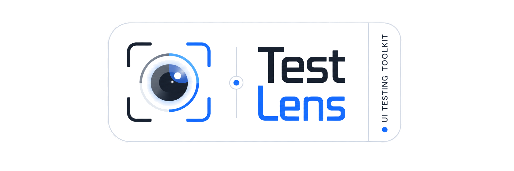
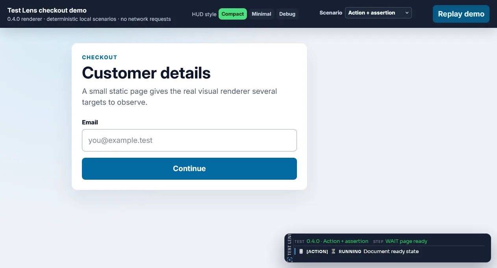

<div class="lens-hero" markdown>



<span class="lens-release-badge">Current stable release: 0.5.0</span>

# Understand what your Selenium test did—and keep the evidence

**Selenium Test Lens is a Java library that adds observable interactions, reusable waits and assertions, visible recovery, and durable diagnostics to the WebDriver your project already owns.**

Watch actions, waits, assertions, retries, and selected network activity while a test runs. After finalization, investigate the same session through a structured trace, HTML/JSON reports, screenshots, and—on failure—a portable evidence bundle.

Adopt it gradually: keep your runner, WebDriver factory, Page Objects, raw Selenium calls, and reporting stack. Attach Lens where diagnostics help, observe existing Selenium references explicitly, and move selected flows to the Lens-native locator API when its semantics are useful.

[Get started](getting-started.md){ .md-button .md-button--primary }
[Integrate with AI](ai-assisted-integration.md){ .md-button }
[Explore capabilities](#product-capabilities){ .md-button }

<small>`latest` serves release 0.5.0. [Read what changed in 0.5.0](whats-new-0.5.0.md) or [browse exact public signatures](reference/public-api-catalog.md).</small>

</div>

## What Test Lens adds to Selenium

Selenium remains the browser automation engine. Test Lens connects everyday browser work to one diagnostic lifecycle:

```text
your existing WebDriver, runner, and Page Objects
        ↓
observed Selenium calls or Lens-native locators and interactions
        ↓
HUD · target highlights · waits · assertions · recovery · network diagnostics
        ↓
trace · HTML/JSON reports · screenshots · failure bundle · optional integrations
```

Adding the dependency does **not** instrument every existing `WebDriver` or `WebElement` reference. `TestLens.attach(driver)` establishes the lifecycle; existing calls become observable only when code uses the facade returned by `lens.observeDriver()` or an explicitly wrapped element. `UiLocator` is a separate, opt-in interaction API with semantic queries, fresh-DOM polling, actionability diagnostics, and bounded recovery behavior.

## Why teams add Test Lens

<div class="grid cards lens-benefits" markdown>

-   **See the test as it runs**

    The in-page HUD correlates the current test and step with actions, waits, assertions, recovery attempts, and network diagnostics. Pointer-transparent highlights show which target was resolved without changing the application result.

-   **Write intent, not repeated plumbing**

    Semantic and scoped locators, collection operations, form actions, browser-context helpers, polling assertions, and application-readiness waits replace common `findElements` loops, sleeps, and one-off helper code.

-   **Make recovered instability visible**

    A recovered click or lookup is recorded as recovery, not silently presented as a clean pass. Retry summaries and outcome policies help distinguish condition polling, operation recovery, and runner-level test retries.

-   **Leave useful evidence behind**

    Finalization produces a trace and reports. Failed sessions can add diagnostic and clean screenshots, failure context, a network summary, a manifest, and a ZIP suitable for controlled CI retention.

-   **Apply explicit data boundaries**

    Diagnostic text is redacted before fan-out to HUD, trace, sinks, reports, and bundles. Screenshot masking is configured separately and can fail closed; replayable authentication state remains sensitive by design.

-   **Adopt without replacing the framework**

    Manual lifecycle works with any runner. Optional JUnit 5 and TestNG adapters manage invocation lifecycle, while the Allure adapter attaches completed Lens evidence to an existing Allure result.

</div>

<span id="signature-capabilities"></span>

## Product capabilities

### Locators, collections, and element state

`UiLocator` is a lazy description that resolves against the current DOM when an operation runs. Start with Selenium `By`, or use intent-oriented factories such as `getByRole`, `getByLabel`, `getByPlaceholder`, `getByAltText`, `getByText`, and `getByTestId`. Role/name matching uses browser/WebDriver accessibility data rather than pretending visible text is the complete accessible name.

Compose a query without escaping its selected UI region: `locator(...)` searches descendants, `filterHas(...)` keeps matching parents, and text/attribute filters, `nth`, `first`, and `last` preserve pipeline order. Collections expose current `resolveAll()`/`count()` snapshots and fresh-snapshot count waits.

```java
UiLocator availableCards = lens.locator(By.cssSelector(".product-card"), "Available products")
        .filterByAttribute("data-status", "available")
        .filterHas(lens.getByRole("button", "Buy"));

availableCards.first()
        .locator(lens.getByRole("button", "Buy"))
        .click();
```

Use [semantic and scoped locators](elements/locators.md), [collections](elements/collections.md), and [element information](elements/information.md) for practical contracts and boundaries. Queries remain in the current frame/window and do not cross shadow roots automatically.

### Actions, forms, and browser context

Lens-native interactions cover click, fill, clear, keys, hover, double/right click, check/uncheck, upload, focus, scrolling, and native `<select>` controls. Frame, parent/default-content, window/tab, new-window, and alert helpers retain explicit Selenium context ownership. Known application overlays can be handled through an explicit policy rather than a global promise that every obstruction is recoverable.

The standard click path shares one deadline across a bounded `NATIVE → ACTIONS → POINT → JS` cascade. Physical fallbacks require a current hit-test owned by the target or a descendant. The final `HTMLElement.click()` fallback is configurable, hidden or disabled targets still fail, and an ambiguous native delivery is never followed by a blind second click. Operations that are not safe to repeat do not become universally retryable.

[Review the click and form-action contracts](elements/actions.md), [select controls](elements/select-controls.md), [browser context](browser-context/index.md), and [overlay policies](advanced/overlay-policies.md).

### Smarter waits and polling assertions

Element waits re-resolve against the current DOM and poll visibility, hidden state, Selenium clickability, text, or collection count. Assertions cover visibility, text/value, attachment, enabled/selected/checked state, attributes, classes, CSS, collection counts, and page URL/title. They report structured reasons instead of forcing each test to combine a loop, sleep, and one-time read.

Page helpers distinguish document readiness from SPA readiness. `waitForPageReady` observes `document.readyState`; the XHR/fetch idle helper sees only calls that start after its tracker is installed; optional React/SPA helpers add DOM-convention checks. Ordinary polling is not a recovery retry and does not mark a session flaky.

```java
lens.getByTestId("results").waitUntilVisible();
lens.getByRole("button", "Save").waitUntilClickable().click();
lens.getByTestId("status").expect().toHaveText("Saved");
lens.expectPage().toContainUrl("/profile");
```

[Compare element and page waits](elements/waiting.md) and [polling assertions](elements/assertions.md).

### Existing Selenium observation and Lens-native semantics

For an existing Page Object, pass the explicit observed facade before constructing it:

```java
TestLens lens = TestLens.attach(rawDriver, options);
WebDriver observedDriver = lens.observeDriver();
LoginPage page = new LoginPage(observedDriver);
```

Calls such as `findElement(...).click()`, `clear()`, and `sendKeys(...)` retain native Selenium semantics and are delegated once. Observation adds operation correlation, timing, source metadata, redacted diagnostics, and automatic highlight lifecycle; it does **not** add Smart Click, locator waits, actionability recovery, another lookup, or JavaScript fallback. Old references remain raw. Use `UiLocator` when the Lens-native behavior is wanted.

[Integrate an existing driver and Page Objects](getting-started.md#observe-ordinary-selenium-calls).

### Live HUD and element highlights

The live HUD shows the active test and step plus semantic rows for actions, waits, assertions, recovery, manual entries, and enabled network diagnostics. Presets are `MINIMAL`, `COMPACT`, `STANDARD`, and `DEBUG`; content filters, position, bounded size, header, typography, scrollbar, palette, opacity, timestamps, branding, and highlight states are configurable.

Local Source Navigation is optional. A row needs captured source metadata, a valid project mapping and provider target, the feature enabled, and the navigation mode activated. Compatibility status and the ON banner do not manufacture missing source metadata or prove that a target can be opened.

HUD injection and cleanup are best effort and cannot decide a Selenium outcome. The persistent record is the trace. [See visual diagnostics](observability/visual-diagnostics.md) or use [HUD Studio](observability/hud-studio.md), a synthetic documentation preview backed by the runtime renderer.

### Recovery that remains visible

Test Lens separates three mechanisms:

1. **Condition polling** observes state until it matches or times out.
2. **Recovery retry** schedules another physical operation attempt after a configured recoverable failure.
3. **Runner retry** starts another JUnit/TestNG invocation and therefore another Lens session.

`RetrySummary` records recovery attempts and time lost. `RetryOutcomePolicy` can report, warn, or reject an otherwise passed session after evidence is finalized. This does not eliminate flaky tests; it makes recovered instability measurable and reviewable. [Interpret recovery and outcome policies](observability/flakiness.md).

### Trace, logs, reports, and failure evidence

Each finalized session connects transient browser feedback to durable artifacts:

```text
action / wait / assertion / network event
        ↓
bounded session trace and retry summary
        ↓
exactly-once PASSED / FAILED / SKIPPED finalization
        ↓
trace.json + report.html
        ↓ FAILED
diagnostic and clean screenshots + manifest + failure bundle ZIP
```

Structured logging supports in-memory, console, consumer, composite, and text/JSON/HTML export paths. Screenshots are viewport-based by default; bounded opt-in full-page capture scrolls and stitches with WebDriver rather than CDP. A video file can be attached as caller-supplied evidence—Lens does not record video.

Failure collectors are best effort and never replace the original test failure. CI or another system still owns artifact retention. Explore [trace](observability/trace.md), [logging](observability/logging.md), [reports](observability/reports.md), [screenshots](observability/screenshots-evidence.md), and [failure bundles](observability/failure-bundles.md).

### Report delivery and existing reporting stacks

After successful finalization, `ReportUploader` can synchronously stream one completed report ZIP to an explicitly configured HTTP endpoint. Upload is never automatic, does not re-finalize the session, and does not own or close WebDriver. The optional Allure module instead attaches selected finalized Lens artifacts to the active Allure test or step; it does not capture a second screenshot or change Allure status.

[Implement explicit report upload](observability/report-upload.md) or [attach evidence to Allure](integrations/allure.md).

### WebDriver BiDi network diagnostics

With Selenium Java 4.39.0+, a compatible browser/driver and a BiDi-enabled session, Lens can passively correlate requests, completed responses, redirects, and fetch errors. Immutable snapshots feed waits, assertions, HUD rows, JSON evidence, and failure-bundle summaries. Capture must become active before an empty snapshot can prove that no failures occurred.

This is observation, not interception: Lens does not block, modify, mock, replay, or capture bodies, and it has no CDP fallback. Separately, `apiCallWithModal(...)` displays request/response previews supplied by the caller; it does not discover browser traffic. [Configure network diagnostics and their limits](advanced/network.md).

### Text redaction and screenshot masking

`RedactionPolicy.defaults()` protects recognized credentials, sensitive fields, URL components, exception copies, network data, reports, and failure-bundle text before diagnostic fan-out. The original throwable still controls the test result. Rules can add sensitive keys and literal secrets; disabling redaction is an explicit opt-out.

`VisualRedactionOptions` separately masks configured screenshot regions. Password inputs receive SOLID masking by default, and STRICT mode refuses to publish when a required mask cannot be verified. Blur reduces readability but is not a guarantee of anonymization. Video, unmasked pixels, unknown secret formats, and replayable auth-state files remain outside the text-redaction guarantee.

[Understand text-redaction coverage](security/redaction.md) and [screenshot masking](security/visual-redaction.md).

### Authentication state, test state, and resources

Managed Auth State restores cookie/Web Storage state, validates it through an application callback, and performs at most one login when recreation is justified. Atomic replacement protects the previous file; origin validation prevents mutation in a foreign origin. The file may contain live credentials and must be stored as sensitive material.

Scenario state is typed and isolated to one physical invocation. Suite state is shared only when requested inside one run. Scenario resources perform exactly-once LIFO cleanup across pass, failure, skip, and retry finalization. These are in-memory lifecycle tools, not disk-backed cross-JVM session storage.

[Manage authentication state](advanced/auth-state.md) and [test state/resources](features/managed-test-state.md).

### React and dynamic SPA behavior

The optional `selenium-test-lens-react` artifact re-finds elements across rerenders, recognizes configured and common observable busy/loading DOM states, waits for roots and DOM stability, and supports known React Select markup. It works through observable DOM conventions; it does not inspect the React component tree or promise compatibility with every component library.

[Choose React and SPA helpers deliberately](features/react-spa.md).

### Lifecycle adapters and advanced composition

The main `TestLens` facade is runner-neutral. Manual integration leaves driver creation and `quit()` with the consumer. Optional JUnit 5 and TestNG adapters map invocation outcome, finalize evidence, and close only adapter-owned drivers; parameterized, repeated, DataProvider, parallel, and runner-retried invocations keep separate Lens sessions. Named steps and business assertions can add domain-level structure without replacing the runner.

[Compare manual, JUnit 5, and TestNG lifecycle](framework-integration.md), then see [named steps and business assertions](advanced/steps-business-assertions.md).

## See the result

{ loading=lazy width=1600 height=900 }

<small>This recorded 0.4.0 example shows the runtime HUD correlating an action and assertions with their terminal status. The HUD is transient; the same session data continues into trace/report output, and a failed finalization can add clean and diagnostic screenshots plus a failure bundle. <a href="demo/hud/">Open the deterministic HUD demo</a> or [inspect persistent report formats](observability/reports.md).</small>

## Quick start

### I have an existing Selenium project

Add the main artifact, keep Selenium explicit, attach Lens to the driver your framework already creates, and finalize the session before the existing driver cleanup. No Page Object rewrite is required for manual lifecycle or explicit native observation.

[Install and attach Test Lens](getting-started.md) · [Integrate existing lifecycle and Page Objects](framework-integration.md)

### I want the Lens-native interaction API

Inside an active session, move selected flows to `UiLocator` when scoped queries, polling assertions, Smart Click diagnostics, or recovery evidence reduce your own helper code:

```java
lens.getByLabel("Email").fill("person@example.test");
lens.getByRole("button", "Continue").click();
lens.getByTestId("confirmation").expect().toBeVisible();
```

[Learn locators, actions, waits, and assertions](elements/index.md) · [See complete lifecycle examples](examples.md)

### I want an AI agent to prepare the integration

The [AI Integration Builder](ai-assisted-integration.md) creates a version-bound prompt for an external coding agent from your selected runner, browser ownership, diagnostics, and security choices. It is a documentation tool—not an AI model embedded in Test Lens and not a guaranteed automatic installer.

## Requirements and optional capabilities

| Surface | Requirement and boundary |
|---|---|
| Base library | Java 17+, the `io.github.test-lens:selenium-test-lens:0.5.0` artifact, and Selenium kept as an explicit consumer dependency. Lens attaches to a caller-owned driver. |
| JUnit 5 / TestNG | Optional published adapter artifacts. Use them only when the adapter should own the configured driver/session lifecycle. |
| Allure | Optional `selenium-test-lens-allure` artifact and an active Allure lifecycle. It publishes finalized evidence; it is not the evidence collector. |
| React/SPA | Optional `selenium-test-lens-react` artifact. Detection is based on observable DOM states and known markup conventions. |
| BiDi network capture | Selenium Java 4.39.0+, a compatible browser/driver/transport, BiDi enabled when creating the session, and explicit capture startup. |
| Source Navigation | Captured source metadata, an enabled feature, active navigation mode, valid local project mapping, and a supported local provider. |
| Evidence and upload | Local files remain local unless the consumer or CI stores them, Allure attaches them, or `ReportUploader` explicitly sends a package. |

Selector/application tooling and Studio are separately published implementation dependencies in 0.5.0; their technical Java surfaces are not all stable USER API. Compatibility tooling, migration tooling, Selector Lab, examples, and browser-test modules remain unpublished. [See the maintained product capability inventory](maintainers/product-capability-map.md) for the release boundary and evidence behind this overview.

## What's new in 0.5.0

The product overview above describes the complete release. These are selected changes relative to earlier versions:

- Explicit native Selenium observation connects supported ordinary `WebDriver`/`WebElement` calls to semantic diagnostics without changing native execution semantics.
- Independent browser-execution and `DEFAULT`/`FAST` observability modes make live presentation cost explicit while preserving failure evidence.
- Semantic operation lifecycles correlate action, wait/retry, assertion, locator, and terminal status across HUD, highlights, reports, and trace.
- TestNG `PER_CLASS` can reuse an adapter-owned driver for sequential methods while preserving a fresh Lens session per physical invocation.
- Trace retention, source metadata, bounded Smart Click behavior, network startup diagnostics, and runner lifecycle contracts were strengthened.

[Read the complete 0.5.0 release overview](whats-new-0.5.0.md) · [Read the changelog](https://github.com/Test-Lens/selenium-test-lens/blob/main/CHANGELOG.md)

## Explore the documentation

- [Capabilities and ownership boundaries](capabilities.md)
- [Elements: locators, actions, waits, assertions, and collections](elements/index.md)
- [Observability and persistent artifacts](observability/index.md)
- [Security boundaries](security/redaction.md)
- [Integrations](integrations/index.md)
- [Configuration](configuration.md)
- [Exact public API catalog](reference/public-api-catalog.md)
